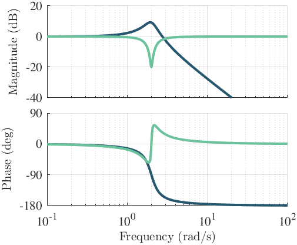

# preplot-postplot

[](https://doi.org/10.5281/zenodo.14164828)
[](https://github.com/jesseishi/preplot-postplot/releases)
[](https://nl.mathworks.com/products/matlab.html)
[](LICENSE)

Easily make beautiful (control) plots in Matlab by avoiding repetitive code.
The basic idea is simple:

```Matlab
preplot();
plot(1:10)
postplot();
```

From here on it is just customization:

```Matlab
colors = [0.15, 0.34, 0.43;
    0.42, 0.76, 0.61];
[f, axs] = preplot(2, 1, 'sharex', 'all', 'interpreter', 'latex', ...
    'colororder', colors);

x = linspace(0, 5, 1e5);
plot(axs(1), x, [sin(x); cos(x)])
plot(axs(2), x, [log10(x); log(x)])
ylabel(axs(1), '$\alpha$')
ylabel(axs(2), '$\beta$')
xlabel(axs(2), 'Time (s)')

postplot(f, 'Images/test.pdf', 'width', 5, 'figSizeUnits', 'inches', ...
    'aspectRatio', 1.5, 'fontSize', 16, 'legendFontSize', 14, ...
    'lineWidth', 3);
postplot(f, 'Images/test2.pdf', 'width', 10, 'figSizeUnits', 'inches', ...
    'aspectRatio', 1.5, 'fontSize', 20, 'legendFontSize', 16, ...
    'lineWidth', 5);
```

Here, [preplot](src/preplot.m) produces a 2x1 figure where only the bottom figure will
have an xTickLabel and the x limits and ticks will be shared. Furthermore, all text is
interpreted by Latex. Then, two calls to [postplot](src/postplot.m) both save a figure
(nice if you need the same figure in two different sizes, e.g. a paper and a
presentation). Both specify the size, fontsize, and linewidth and saves the figure in
the 'Images' folder (which will be created if it did not yet exist).



For more examples, see [examples.m](src/examples.m) and for all the options see the
documentation of [preplot](src/preplot.m) and [postplot](src/postplot.m).

## Using it in your project

There are of course multiple ways to integrate this into your own project. The method
that I like is to add it as a
[git submodule](https://git-scm.com/book/en/v2/Git-Tools-Submodules) to an existing
repository. This way your different projects can have different versions of this toolbox
so that old projects won't be affected by breaking changes to this toolbox.

## Limitations

- It does not work well together with plots from Matlab's Control Toolbox because those
  plots (e.g. `bode`) change a lot of the figure properties internally, so this repo
  also includes some custom control toolbox plots (e.g. `mbode`).
- When initializing all the axes with `preplot`, some properties get locked in. So you
  either need to set them before plotting or adjust `preplot` so that it doesn't set
  these properties. Example: `loglog()` does not work with `preplot` unless you set
  `preplot('hold', 'off')`, alternatively, you can use
  `preplot('XScale', 'log', 'YScale', 'log')` and then just use `plot` to plot on a
  logarithmic axis.

## Contributing

This is just a little project of mine but it would be cool to make it work for more
people. If you encounter issues or use cases that are not supported yet, or have an idea
how to make it better, just contact me or file an issue or pull request on GitHub.

## License

This project is licensed under the MIT License. See the [LICENSE](LICENSE) file for
details.
