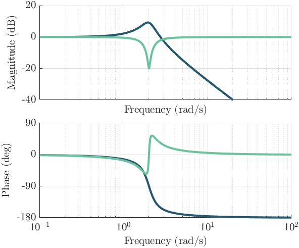

# preplot-postplot
Easily make beautiful (control) plots in Matlab by avoiding repetitive code.


## Examples
The basic idea is simple:
```Matlab
preplot();
plot(1:10)
postplot()
```
From here on it is just customization:
```Matlab
colors = [0.15, 0.34, 0.43;
          0.42, 0.76, 0.61];
[f, axs] = preplot(2, 1, 'paperFormat', 'WES', 'column', 1, ...
    'aspectRatio', 1.2, 'colororder', colors);

sys1 = tf(4, [1, 0.7, 4]);
sys2 = tf([1, 0.1, 4], [1, 1, 4]);
mbode([sys1, sys2], axs(1,1), axs(2,1))
ylim(axs(1), [-40, 20])

postplot(f, 'Images/example.png', 'fontname', 'NimbusRomNo9L', ...
    'fontSize', 10, legendFontSize', 8, 'sharex', true, 'lineWidth', 2);
```
This produces a figure that fits _exactly_ on a signle column of a publication in Wind Energy
Science, with a suitable aspect ratio, custom colors, custom font, without xticklabels
and xlabel of the top plot because it is shared with the x-axes (which also cause the
x-axes of the plots to be linked zooming in Matlab), a linewidth of 2, and saved as a
png in a folder (which will be created if it did not exist yet).



For more examples, see [`examples.m`](src/examples.m).


## Using it in your project.
There are of course multiple ways to integrate this into your own project. The method
that I like is to add it as a
[submodule](https://git-scm.com/book/en/v2/Git-Tools-Submodules)  to an existing
repository. This way your different projects can have different versions of this toolbox
so that old projects won't be affected by breaking changes to this toolbox.


## Limitations
- Setting the default interpreter to 'Latex', sets it for the current axes but this will
  sometimes be overridden when adjusting other properties or doing some custom stuff.
  I'll have to look more into this.
- It does not work well together with plots from Matlab's Control Toolbox because those
  plots (e.g. `bode`) change a lot of the figure properties internally, so this repo
  also includes some custom control toolbox plots (e.g. `mbode`).
- When initializing all the axes with `preplot`, some properties get locked in. So you
  either need to set them before plotting or adjust `preplot` so that it doesn't set
  these properties. Example: `loglog()` does not work with `preplot` unless you set
  `preplot('hold', 'off')`, alternatively, you can use
  `preplot('XScale', 'log', 'YScale', 'log')` and then just use `plot` to plot on a
  logarithmic axis.


## Contributing
This is just a little project of mine but it would be cool to make it work for more
people. If you encounter issues or use cases that are not supported yet, or have an idea
how to make it better, just contact me or file an issue or pull request on GitHub.
